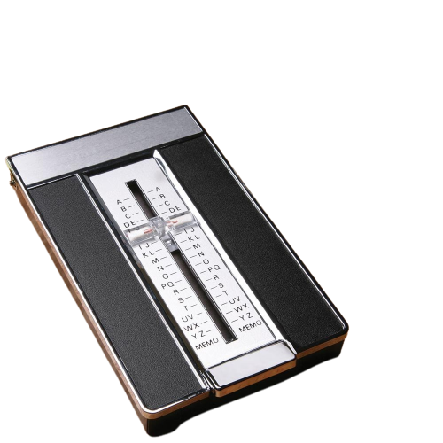
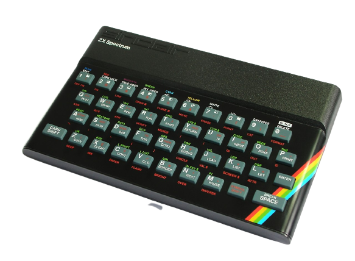

I first started programming when I was 10 or 11. The first program I designed and wrote was a Phone Directory, for the ZX Spectrum 48k. The uptake to use this in my home was very low. I doubt my dad even knew it existed. I employed a data capturer too, but the ratio of data he captured to the number of free meals he enjoyed made this a business failure from day 1. When I launched the Phone Directory system it was clear, how it was largely impractical, my mom found it easier to use the "Flip-open A-Z Phone Directory". The "data capturer" found it easier to eat, than capture data past the letter G.

<!--truncate-->



I could not fathom why something so cool was not usable. The program started with a blinking cursor, asking for the name of the person who's number you were looking for. It then returned the name, but the snag was, if you misspelt it, or as I learnt tried to find anything after the letter 'G' it simply told you that there was no such person. The code looked something like:

```basic
10 PRINT "Kies letter van alfabet: ";
20 INPUT naam$
30 N = 5
40 NAAM$(1) = "De Vries Ambulans"
50 TELNOMMER$(1) = "555-555-5555"
60 NAAM$(2) = "Rina Koning"
70 TELNOMMER$(2) = "555-555-5556"
80 NAAM$(3) = "Ouma en Oom Hannes"
90 TELNOMMER$(3) = "555-555-5557"
100 NAAM$(4) = "Pappa Werk"
110 TELNOMMER$(4) = "555-555-5558"
120 NAAM$(5) = "Oom Wikkie"
130 TELNOMMER$(5) = "555-555-5559"
140 found = 0
150 FOR i = 1 TO N
160   IF naam$ = NAAM$(i) THEN PRINT NAAM$(i); " - "; TELNOMMERS$(i): found = 1: END
170 NEXT i
180 IF found = 0 THEN PRINT naam$; " is nie in gids."
```

Why would nobody load a program through a casette deck and wait for it to load to look up numbers? My wonderfully over-complicated solution to a simple problem, lost to the trusty Yellow Pages and local phone directory. I was not deterred, I just moved on to the next project, one which is still part of my life today. ELIZA Robo Psychologist.

I used a ZX Spectrum 48k to write my first program.


